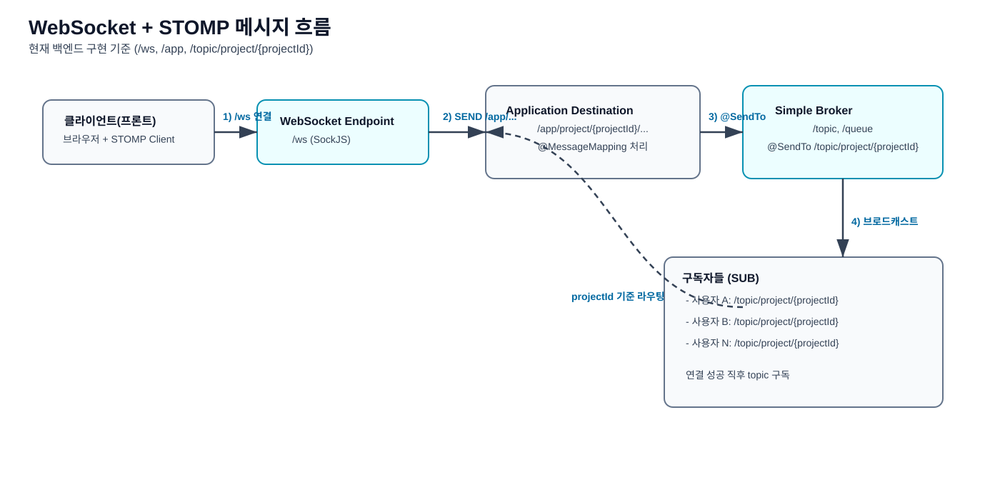

# WebSocket + STOMP 로직 다이어그램

아래 다이어그램은 **현재 백엔드 구현 기준**의 실시간 통신 흐름을 단계별로 보여줍니다.

## 단계별 흐름 (초보자 버전)

1. 프론트가 `/ws` 엔드포인트로 WebSocket(SockJS fallback) 연결을 시작합니다.
2. 연결 성공 후 프론트가 `/topic/project/{projectId}` 를 **구독(SUB)** 합니다.
3. 사용자가 드래그/수정 같은 이벤트를 발생시키면 프론트가 `/app/project/{projectId}/...` 로 **발행(PUB)** 합니다.
4. 서버의 `@MessageMapping` 메서드가 메시지를 받고 `@SendTo("/topic/project/{projectId}")` 로 브로드캐스트합니다.
5. 해당 topic을 구독 중인 클라이언트들이 실시간 업데이트를 받습니다.

## 이벤트 라우팅 예시

- 컬럼 이동: `/app/project/{projectId}/column-move` → `/topic/project/{projectId}`
- 카드 이동(같은 컬럼): `/app/project/{projectId}/card-move-within-column` → `/topic/project/{projectId}`
- 카드 이동(다른 컬럼): `/app/project/{projectId}/card-move-between-column` → `/topic/project/{projectId}`
- 컬럼 추가/삭제, 카드 생성/삭제, 카드 정보 변경도 동일한 패턴

## 용어 정리

- **PUB(발행)**: 메시지를 보냄 (클라이언트 → `/app/...`, 서버 → `/topic/...`)
- **SUB(구독)**: 특정 topic을 듣도록 등록 (`/topic/project/{projectId}`)

## 한 줄 결론

이 구조는 **"클라이언트는 /app 으로 보내고, 서버는 /topic 으로 뿌리는"** 규칙을 팀 전체에서 일관되게 유지하기 위한 설계입니다.
